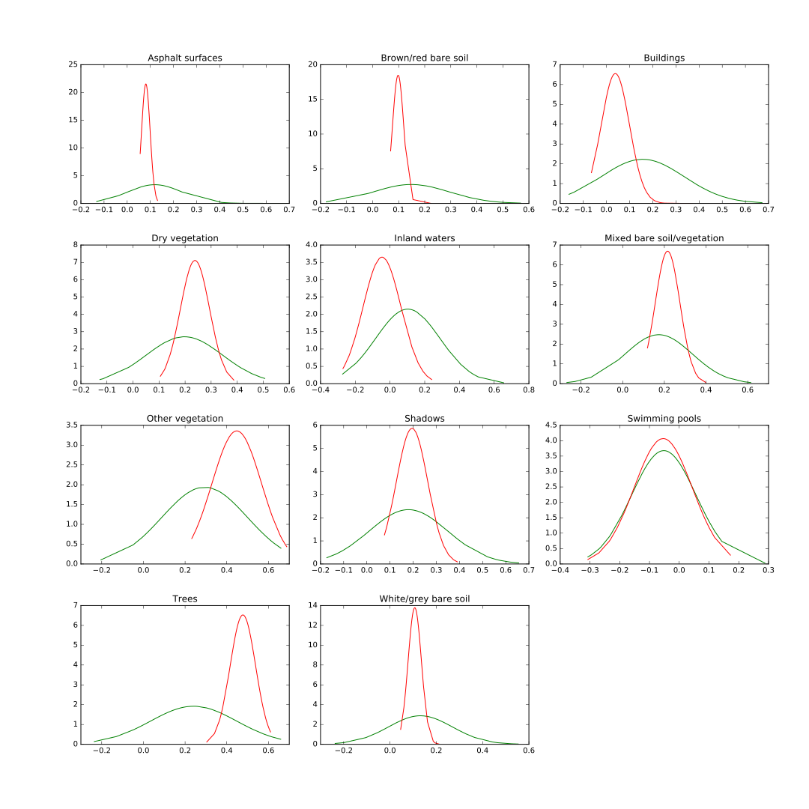
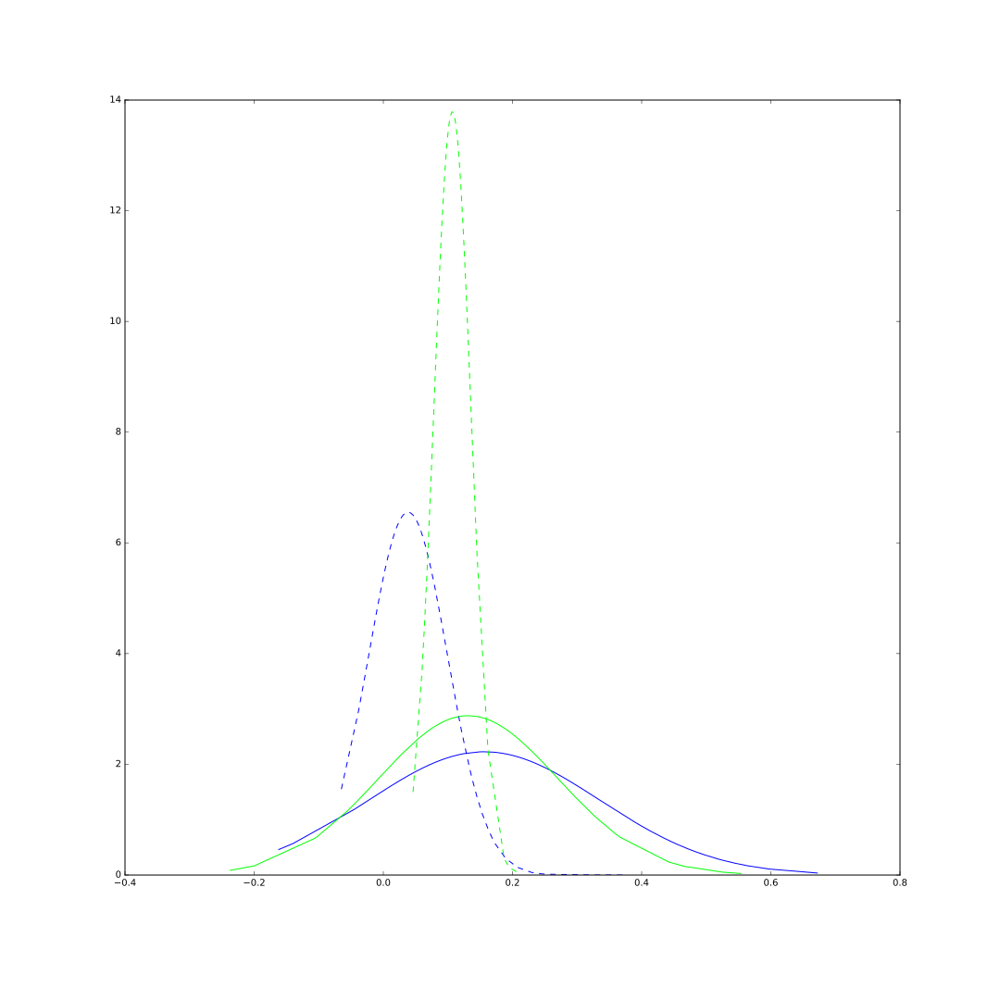

# Probability_density_function_Class_Separability

This piece of code create plots showing the distribution of segment statistics (in fact, the PDF 'Probability Density Function'). It could be usefull to highlight class separability in term of spectral signature for example. 

**Example A**

**Example B**
 