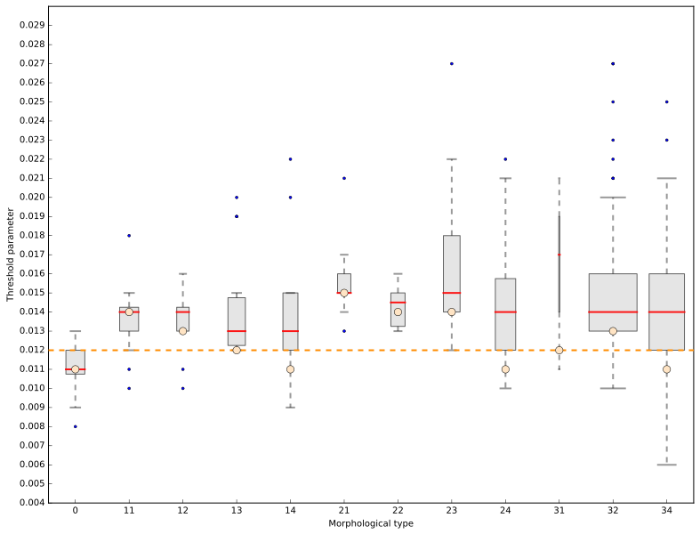

# boxplot_segmentation_parameter_local_approach

This piece of code create a boxplot showing the distribution of segmentation parameter (thresholds) getting using i.segment.uspo in several morphological zones in Ouagadougou (SPIE2017 conference, GRIPPA)

 